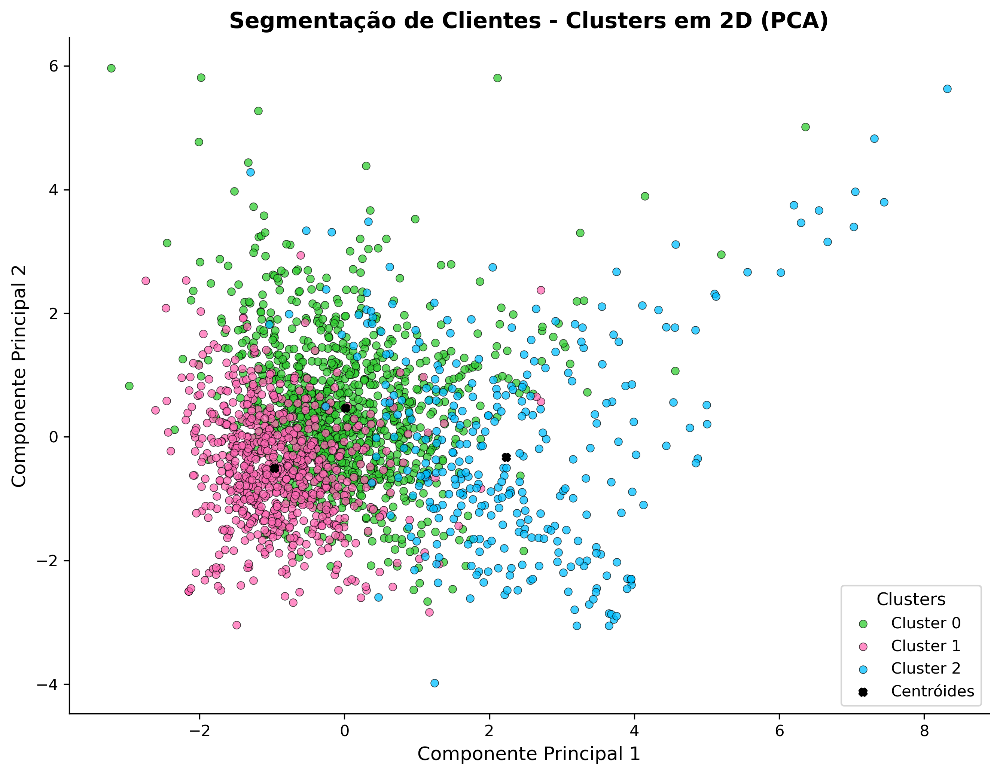

# Segmentação de Clientes com Machine Learning: Clusterização e Estratégias de Personalização Digital para Impulsionar Vendas

#### Autor: [**William Nabhan Filho**](https://www.linkedin.com/in/william-nabhan-filho)
Este projeto tem como objetivo realizar um estudo de **segmentação de clientes** de um supermercado e **extração de regras de associação** entre categorias de itens comprados, a fim de compreender o perfil dos consumidores e propor **estratégias de marketing eficientes**.  

## Objetivo

Utilizar técnicas de **mineração de dados** e **aprendizado de máquina** com Python para:

- Identificar **perfis de clientes** com comportamentos de compra semelhantes;
- Descobrir **padrões de compra conjunta** entre categorias de produtos;
- Propor estratégias para impulsionar as vendas e aprimorar a experiência do usuário: **Sistemas de Recomendação**, **Ordenação Personalizada de Itens** e **Campanhas de Marketing** Segmentadas.

## Fonte e Descrição dos Dados

Os dados utilizados neste projeto são adaptados de um repositório disponível no Kaggle (https://www.kaggle.com/datasets/psparks/instacart-market-basket-analysis), com a finalidade de simular transações de compras online em um supermercado. .

A base utilizada simula transações de um supermercado online e contém mais de **400 mil pedidos** feitos por **30 mil usuários**.

Os metadados detalhados dos arquivos de dados podem ser consultados na seção [Dicionário de Dados](data_dictionary.md).

## Metodologia

1. **Exploração dos Dados (EDA)**  
   - Padrões temporais dos pedidos;
   - Produtos, seções e departamentos mais populares;
   - Comportamento de compra dos clientes;
   - Frequência de recompra.
 
2. **Clusterização**  
   - Cálculo da distribuição proporcional de categorias por cliente.
   - Estudo comparativo entre os algoritmos KMeans e Gaussian Mixture Model (GMM);
   - Definição do número ideal de clusters.
   - Interpretação dos clusters gerados com base nas categorias de compra mais relevantes por grupo.

3. **Obtenção de Regras de Associação**  
   - Extração das regras por cluster aplicando-se o algoritmo Apriori;
   - Utilização de suporte mínimo de 2%;
   - Interpretação dos resultados com foco em orientar estratégias para impulsionar vendas.

4. **Estratégias de Marketing Segmentadas**
   - Personalização Digital: Sistemas de Recomendação e Ordenação Estratégica de Produtos;
   - Campanhas e Promoções.
   
## Principais Resultados

- Identificados **3 perfis distintos de consumidores**, com base nas categorias que mais consomem;
- Identificadas **regras de associação valiosas** e **padrões de compras conjuntas** por cluster;
- **Sistemas de Recomendação Segmentados** para impulsionar vendas cruzadas;
- **Ordenação Estratégica de Produtos** por perfil de cliente;
- Campanhas de Marketing **direcionadas**;

## Relatório Técnico

O projeto conta com um **relatório técnico**, que descreve todas as etapas do estudo.

📄 Acesse aqui: [Segmentação de Clientes com Machine Learning.pdf](Segmentação%20de%20Clientes%20com%20Machine%20Learning.pdf)

## Bicliotecas Utilizadas
- `pandas`, `numpy`, `openpyxl`
- `scikit-learn`
- `mlxtend`
- `joblib`
- `matplotlib`, `seaborn`, `plotly`

## Estrutura de Pastas

<pre>├── 📁 data # Dados
│    ├── 📁 raw # Dados de entrada
│    │    ├── 📄 aisles.csv
│    │    ├── 📄 departments.csv
│    │    ├── 📄 order_products.parquet
│    │    ├── 📄 orders.parquet
│    │    └── 📄 products.csv
│    ├── 📁processed # Dados processados
│    │    ├── 📄 data.parquet
├── 📁notebooks # Jupyter Notebooks com as análises
│    ├── 📄 01_EDA.ipynb
│    ├── 📄 02_Clustering.ipynb
│    ├── 📄 03_Association_Rules.ipynb
│    ├── 📄 04_Marketing_Strategies.ipynb
├── 📁notebooks_html # Jupyter Notebooks com as análises em HTML
│    ├── 📄 01_EDA.html
│    ├── 📄 02_Clustering.html
│    ├── 📄 03_Association_Rules.html
│    ├── 📄 04_Marketing_Strategies.html
├── 📁 results # Arquivos gerados
│    ├── 📄 regras_apriori_cluster_0.xlsx
│    ├── 📄 regras_apriori_cluster_1.xlsx
│    ├── 📄 regras_apriori_cluster_2.xlsx
│    ├── 📄 regras_apriori_cluster_3.xlsx
│    ├── 📄 regras_apriori_cluster_4.xlsx
│    ├── 📄 score_produtos_por_aisle_cluster_0.xlsx
│    ├── 📄 score_produtos_por_aisle_cluster_1.xlsx
│    ├── 📄 score_produtos_por_aisle_cluster_2.xlsx
│    ├── 📄 plot_2d_clusters_pca.png
│    ├── 📄 user_id_clusters.csv
│    ├── 📄 modelo_kmeans_3_clusters.pkl
├── 📁 src # Funções utilizadas nos notebooks e de processamento de dados
│    ├── 📄 eda_visualizations.py
│    ├── 📄 clustering_utils.py
│    ├── 📄 association_rules_utils.py
│    ├── 📄 marketing_strategies_utils.py
│    ├── 📄 process_data.py
├── 📄 Segmentação de Clientes com Machine Learning.pdf
├── 📄 README.md 
├── 📄 data_dictionary.md 
└── 📄 requirements.txt # Dependências do projeto
└── 📄 LICENSE.txt</pre>

